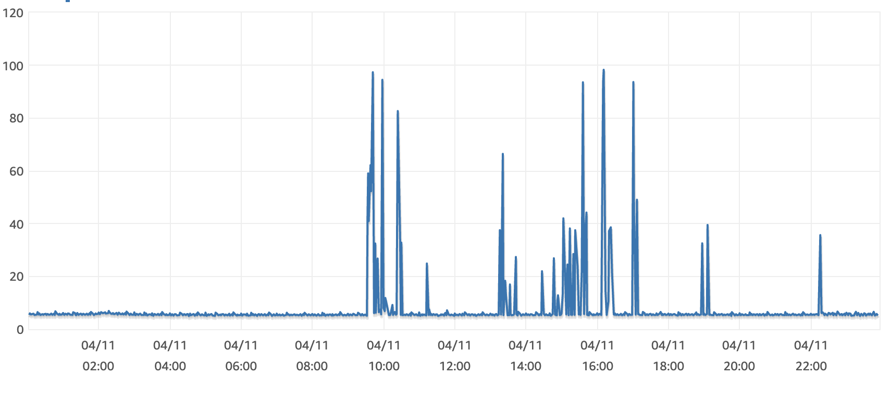
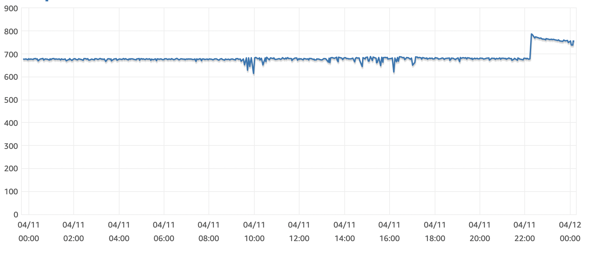
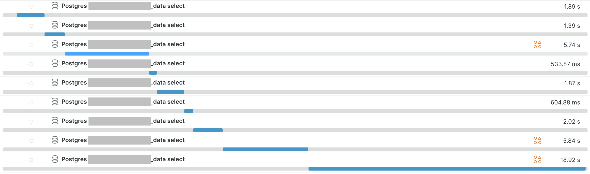
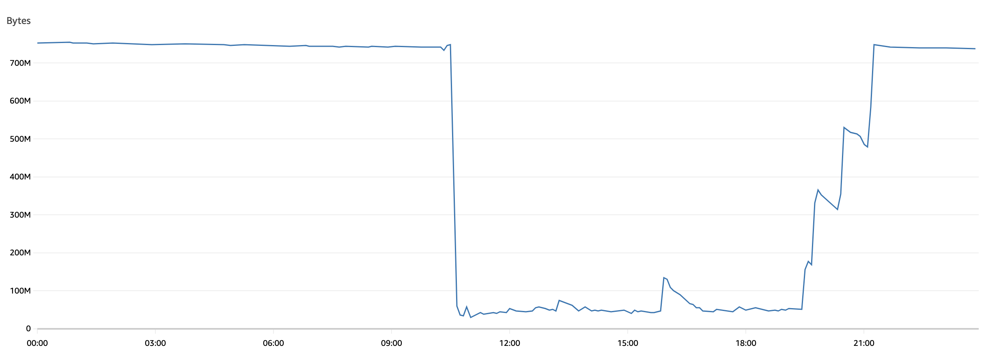
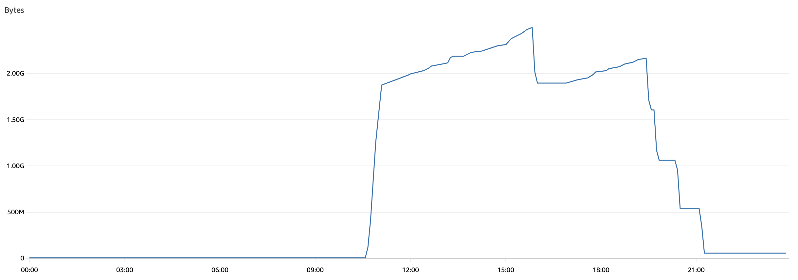

Debugging a Slow Query in Production
====================================

April 2023


tl;dr;
------

 - Slow dashboard in production, yet fast in local dev with a similar dataset 🤔
 - AWS RDS monitors showed CPU spikes with sufficient memory ❓
 - Selectively disabling widgets in dashboard didn't reveal problem
 - New Relic pinpointed the exact query causing the slowness 🎉
 - Explaining query locally shows everything fine, appropriate indexes being used
 - Explaining on production shows indexes not being used, instead `Materialize` nodes popping up in the query plan
 - Confirmed on production that indexes could be used by temporarily disabling materialisation
 - Increasing `effective_cache_size` to 75% of available RAM caused the query to no longer materialise
   and started using the index again. 🏆

Key takeaways
-------------

 - New Relic is awesome and is worth installing the free tier for any project, AWS only provides minimal monitoring
 - `EXPLAIN` is your friend in debugging queries
 - Postgres parameter defaults are conservative. The are acceptable for most setups but keep in mind the need for
   tweaking as usage or data sizes ramp up.


Introduction
------------

I had a problem recently that a dashboard on production was running extremely slow whereas the
same page with the same dataset on local dev was loading in < 1s. The dashboard
had a few different widgets with individual components requiring separate queries.


Initial Investigation
---------------------

Initially it was assumed we were running too many queries - a quick query count showed a few dozen
queries were being run. Whilst not ideal it was deemed still acceptable while we were still in
our product discovery phase.

Checking AWS we looked at RDS monitors to track down the cause. While loading the dashboard we
observed CPU usage spiked to 100% with no memory usage issues.

CPU usage spikes to 100%:


No memory usage issues:


The exact query could not be determined by debugging as everything was operating as expected when run locally.

An attempt was made to isolate the dashboard widget by seletively disabling each widet
and checking the page load. These tests were unsuccessful - which indicated we had other issues
with lazy evaluation of queries.


New Relic
---------

New Relic was installed to help isolate the problem. It was able to
pinpoint the exact location of the issue and showed the problematic query with the tracing
feature.

Tracing showed the problem was related to a table storing IOT data which was queried several times, each
time running much longer than other queries:



Isolating the Query Issue
-------------------------

The problematic query was trimmed down to isolate the particular component causing the slowness.
Our IOT data table was being joined to `generate_series()`. The data table had an index of `(device_id, timestamp)`
which the join should've been using.

Using `EXPLAIN` to check the query plan revealed the index was not being used.

Running the query on local dev shows how the query was inteneded to be run using the index `master_port_device__707d9e_idx`:

```
=> explain (analyze, verbose, buffers)
    SELECT *

    FROM iot_data d
    RIGHT JOIN generate_series(
        '2023-01-11'::date::timestamp at time zone 'Australia/Sydney',
        '2023-04-11'::date::timestamp at time zone 'Australia/Sydney' + '23 hours'::interval,
        '1 hour'::interval
    ) series ON
        d.device_id = 59
        AND series.timestamptz <= d.timestamp
        AND d.timestamp < (series.timestamptz + '1 hour'::interval)
;
                                                                                          QUERY PLAN
-----------------------------------------------------------------------------------------------------------------------------------------------------------------------------------------------
 Nested Loop Left Join  (cost=0.44..584004.60 rows=6564222 width=51) (actual time=1.438..456.110 rows=22093 loops=1)
   Output: d.id, d."timestamp", d.data, d.device_id, series.series
   Buffers: shared hit=7009 read=20532
   ->  Function Scan on pg_catalog.generate_series series  (cost=0.01..10.01 rows=1000 width=8) (actual time=0.333..0.522 rows=2185 loops=1)
         Output: series.series
         Function Call: generate_series('2023-01-11 00:00:00+11'::timestamp with time zone, ('2023-04-11 00:00:00+10'::timestamp with time zone + '23:00:00'::interval), '01:00:00'::interval)
   ->  Index Scan using master_port_device__707d9e_idx on public.iot_data d  (cost=0.43..518.35 rows=6564 width=43) (actual time=0.018..0.207 rows=10 loops=2185)
         Output: d.id, d."timestamp", d.data, d.device_id
         Index Cond: ((d.device_id = 59) AND (d."timestamp" >= series.series) AND (d."timestamp" < (series.series + '01:00:00'::interval)))
         Buffers: shared hit=7009 read=20532
 Planning Time: 0.195 ms
 Execution Time: 456.888 ms
(12 rows)
```

Running on production showed a plan with a `Materialize` node was being created instead, with the join filtering only on timestamp to the materialisation:

```
=> explain (analyze, verbose, buffers)
    SELECT *

    FROM iot_data d
    RIGHT JOIN generate_series(
        '2023-01-11'::date::timestamp at time zone 'Australia/Sydney',
        '2023-04-11'::date::timestamp at time zone 'Australia/Sydney' + '23 hours'::interval,
        '1 hour'::interval
    ) series ON
        d.device_id = 59
        AND series.timestamptz <= d.timestamp
        AND d.timestamp < (series.timestamptz + '1 hour'::interval)
;
                                                                                          QUERY PLAN
-----------------------------------------------------------------------------------------------------------------------------------------------------------------------------------------------
 Nested Loop Left Join  (cost=718.94..1370992.26 rows=7146889 width=4) (actual time=40.483..18165.587 rows=24188 loops=1)
   Output: d.id
   Join Filter: ((series.series <= d."timestamp") AND (d."timestamp" < (series.series + '01:00:00'::interval)))
   Rows Removed by Join Filter: 139593124
   Buffers: shared hit=53723
   ->  Function Scan on pg_catalog.generate_series series  (cost=0.01..10.01 rows=1000 width=8) (actual time=0.118..1.500 rows=2185 loops=1)
         Output: series.series
         Function Call: generate_series('2023-01-10 13:00:00+00'::timestamp with time zone, ('2023-04-10 14:00:00+00'::timestamp with time zone + '23:00:00'::interval), '01:00:00'::interval)
   ->  Materialize  (cost=718.93..84703.06 rows=64322 width=12) (actual time=0.012..3.242 rows=63898 loops=2185)
         Output: d.id, d."timestamp"
         Buffers: shared hit=53723
         ->  Bitmap Heap Scan on public.iot_data d  (cost=718.93..84381.45 rows=64322 width=12) (actual time=24.976..112.327 rows=63898 loops=1)
               Output: d.id, d."timestamp"
               Recheck Cond: (d.device_id = 59)
               Heap Blocks: exact=53666
               Buffers: shared hit=53723
               ->  Bitmap Index Scan on iot_data_device_id_9fa58fda  (cost=0.00..702.85 rows=64322 width=0) (actual time=8.182..8.182 rows=63898 loops=1)
                     Index Cond: (d.device_id = 59)
                     Buffers: shared hit=57
 Query Identifier: -7723023077699807144
 Planning Time: 0.122 ms
 Execution Time: 18167.938 ms
(22 rows)
```

To confirm that the index could be used on production, I temporarily [disabled the query planner's use of
materialisation](https://www.postgresql.org/docs/current/runtime-config-query.html#GUC-ENABLE-MATERIAL)
with the following:

```
SET enable_material = 'off';
```

and the query started using the index as expected.


effective_cache_size
--------------------

Postgres opting to materialise queries in a plan signalled that the RDS' default parameters needed reviewing.
The parameter
[`effective_cache_size`](https://www.postgresql.org/docs/current/runtime-config-query.html#GUC-EFFECTIVE-CACHE-SIZE)
is used to determine whether an index is likely to be used or not. Postgres' default is 4GB but RDS has a mechanism
for storing certain params that may depend on the instance size using a variable `DBInstanceClassMemory`. For
`effective_cache_size` RDS' default is 50%, which is a standard recommendation:

```
{DBInstanceClassMemory/16384}
```

To decipher:
 - `DBInstanceClassMemory` is an RDS variable specifying the amount of available memory available to the instance,
   letting you specify params relative to the instance size.
 - `effective_cache_size` is specified in 8kB blocks
 - the default is effectively set to 50% of the available mem: `DBInstanceClassMemory / 2 * 8kB`

We have some room to move here as the [recommended range is
50-75%](https://www.crunchydata.com/blog/optimize-postgresql-server-performance).
AWS reportedly spits the dummy with too many operators in the RDS params so we can simplify
`DBInstanceClassMemory * 0.75 * 8kB` to `DBInstanceClassMemory*75/819200`

```
{DBInstanceClassMemory*75/819200}
```

This is a temporary fix to tune Postgres & resolve the slow dashboard; we will need to scale up RDS as we move
further along product development as well as looking at other options like managing the IOT data table and/or
caching dashboard queries if/where appropriate.


Bumping RDS
-----------

A couple of days later the Postgres instance started consuming the entire memory and also showed major swapping for the
entire day:

Freeable memory


Swap usage



RDS was increased to t3.medium which allocates 4GB RAM, increasing `effective_cache_size` to ~2.7GB:

```
=> show effective_cache_size;
 effective_cache_size
----------------------
 2819888kB
```

The occasional query was still being materialised and the dashboard was loading in around 10s.


random_page_cost
----------------

Checking database size:

```
=> select pg_size_pretty(pg_database_size('iot'));
 pg_size_pretty
----------------
 1668 MB
(1 row)
```

 - seq_page_cost = 0.1
 - random_page_cost = 0.1

After setting this there were no more materialised queries & the dashboard loaded in 1s.


A BRIN index is not suitable for this table
-------------------------------------------

BRIN indexes are usually prescribed for append-only tables such as these however the correlation
stats suggest that this particular table is unsuited:

```
=> SELECT attname, correlation FROM pg_stats WHERE tablename = 'iot_data';
  attname  | correlation
-----------+-------------
 id        | -0.06479516
 timestamp | -0.06479516
 data      |   0.6425919
 device_id | -0.01199031
(4 rows)
```

A correlation of near 1 or -1 is a good candidate for BRIN as it shows the columns are either
correlated or inversely correlated respectively.

This may be due to the fact that entries are usually inserted in 5 min intervals meaning that
groups of rows have an identical timestamp.
